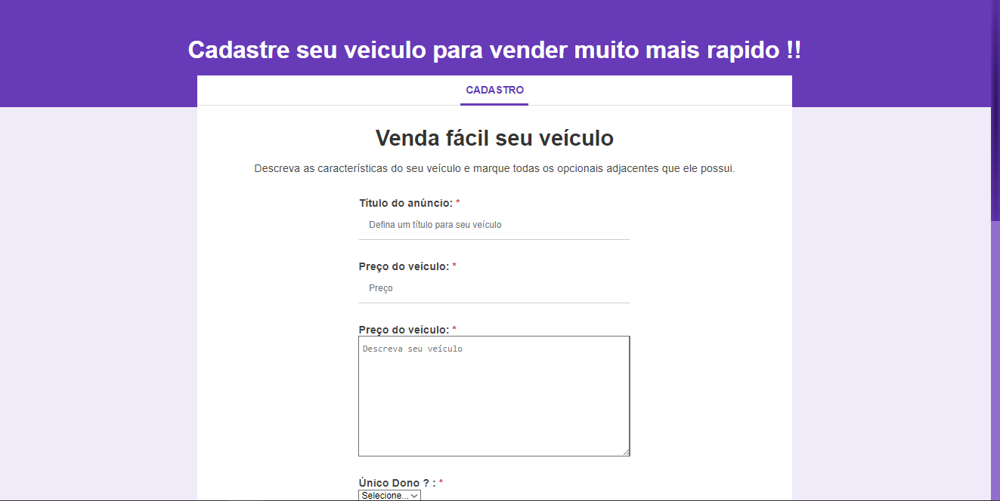
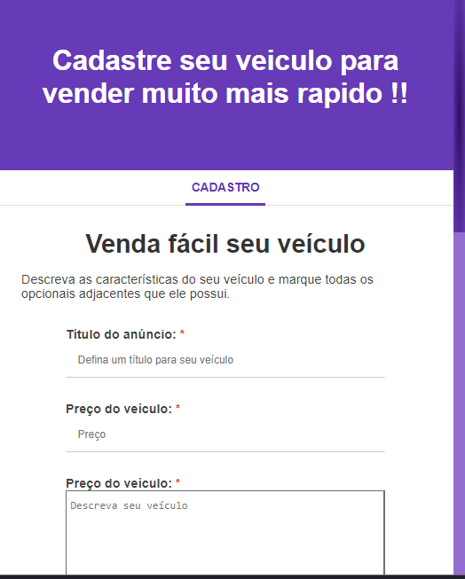

<h1 align="center">
  ✏️ Projeto Formulário ✏️ 
</h1>

<p align="center">
   

  

  

  <br>
  
  <a href="https://www.codacy.com/manual/Gabriel4420/projetoFormulario?utm_source=github.com&amp;utm_medium=referral&amp;utm_content=Gabriel4420/projetoFormulario&amp;utm_campaign=Badge_Grade">
    
  </a>
  
  


  <a href="https://www.linkedin.com/in/gabriel-rodrigues-perez-2069b072/">
    
  </a>
</p>

---

<p align="center">
  
  
</p>

---

# Indice

- ✏️: [Sobre o Projeto](#✏️-sobre-o-projeto)
- 👨‍💻️ [Tecnogias utilizadas](#%EF%B8%8F-tecnogias-utilizadas)
- 📦️ [Como utilizar o projeto](#%EF%B8%8F-como-utilizar-o-projeto)
---

## ✏️: Sobre o Projeto

A propósta do projeto é o aprendizado sobre os diversos tipos de campos de formulários existentes no html, além de promover o estudo de técnicas simples de responsividade para formulários.

---

## 👨‍💻️ Tecnogias utilizadas

O projeto foi desenvolvido utilizando as seguintes bases:

- HTML5
- CSS3
- reset Framework. 

### IDE

  - [Visual Studio Code](https://code.visualstudio.com/)
  - [live_Server](https://marketplace.visualstudio.com/VSCode)
---

## 📦️ Como utilizar o projeto

Para copiar o projeto, utilize os comandos:

```bash
  # Clonar o repositório
  ❯ git clone https://github.com/Gabriel4420/projetoFormulario.git

  # Entrar no diretório
  ❯ cd public
```

---

<h4 align="center">
  Feito com ❤️ por Gabriel Rodrigues 👋️ <a href="mailto:gabriel_rodrigues_perez@hotmail.com">Entre em contato!</a>
</h4>

<p align="center">

  <a href="https://www.linkedin.com/in/gabriel-rodrigues-perez-2069b072/">
    
  </a>
  <a href="https://www.facebook.com/gabriel.rodrigues.perez">
    
  </a>
  <a href="https://www.instagram.com/gabriel_rodrigues_perez/">
    
  </a>
  
  
</p>